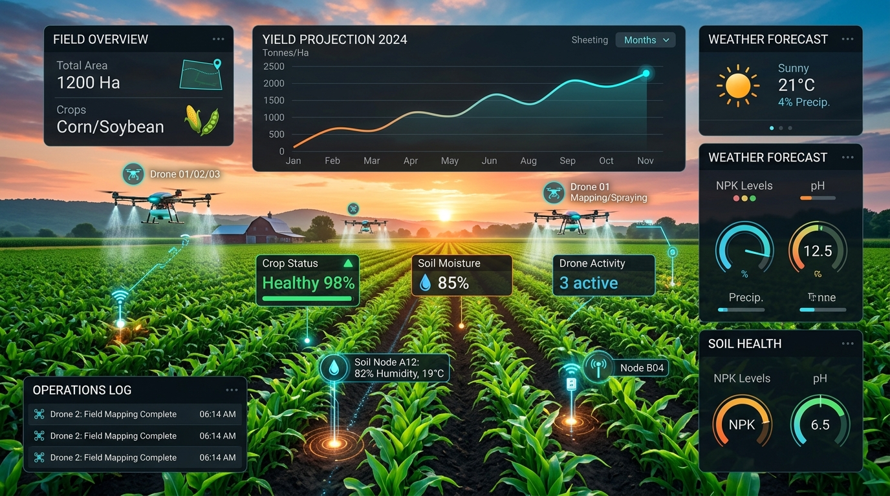

# 🌱 Raiz Agro Hub — Conectando agronegócio, inovação e oportunidades

Plataforma inteligente de conexão entre **produtores rurais**, **AgTechs**, **empresas** e **instituições** do agro.



---

## 🎯 Proposta de Valor (Baseado no Pitch Deck Oficial)

O **Raiz Agro Hub** resolve o gap existente entre a demanda real dos produtores rurais (oferta dispersa, pouco tempo para pesquisar, necessidade de reduzir custos e aumentar produtividade) e o desafio das AgTechs (dificuldade de acesso a clientes aderentes, esforço comercial alto e necessidade de validar soluções em campo).

### 🚀 Diferencial Central
> **Transformar a oferta dispersa em match qualificado e oportunidade real de negócio.**

---

## ⚡ Estrutura da Plataforma & Seções

1. **Apresentação & Hero Section:** Identidade visual fiel ao pitch deck (Verde Floresta `#0D3A22`, Verde Folha `#68B632`), telemetria no campo (NDVI 0.72, Produtividade +18%, Umidade 32%).
2. **O Problema e a Oportunidade:** Comparativo lado a lado das dores do produtor vs. dores das empresas/AgTechs.
3. **Como Funciona:** Fluxo de 5 passos integrados, conectando o cadastro inicial ao **Matchmaking Inteligente**.
4. **Simulador de Matchmaking IA (Slide 7):** Demonstração interativa de cruzamento de critérios técnicos, econômicos e operacionais (Ex: Produtor João Paulo 94% Match com Geo IA).
5. **Mercado e Oportunidade:**
   - 70 mil estabelecimentos em MS
   - 350 mil no Centro-Oeste
   - +5 milhões no Brasil
   - 2.075 AgTechs no país (78% da América Latina)
   - Validação inicial em Mato Grosso do Sul com conexão estratégica à **Rota Bioceânica**.
6. **Modelo de Negócio:** Monetização híbrida (Assinaturas AgTechs, Jornada Freemium Produtores, Participação em negócios gerados).
7. **Validação & Apoio Institucional:** 20 validações com produtores, 11 com AgTechs e **apoio estratégico da Acrissul**.
8. **Time Fundador:** Adriana Tozzetti, Fernando Riedo, Antônio Coelho, Wellington Ramos e Fabíola Camilo.
9. **Cadastro & Lead Capture:** Formulário dinâmico segmentado para Produtores Rurais e AgTechs.

---

## 🛠️ Tecnologias

- **HTML5 Semântico & Acessibilidade**
- **Vanilla CSS3:** Design System moderno, layout responsivo e transições fluidas.
- **JavaScript Moderno (ES6+):** Simulador de Matchmaking em tempo real e formulários interativos.
- **Fontes:** `Outfit` & `Plus Jakarta Sans`.

---

## 🚀 Como Executar Localmente

```bash
python3 -m http.server 8000
```
Acesse [http://localhost:8000](http://localhost:8000).

---

## 🌐 Repositório Remoto
GitHub: [https://github.com/eixox-solutions/raiz-agro-hub](https://github.com/eixox-solutions/raiz-agro-hub)

---
© 2026 **Raiz Agro Hub**. Todos os direitos reservados.
